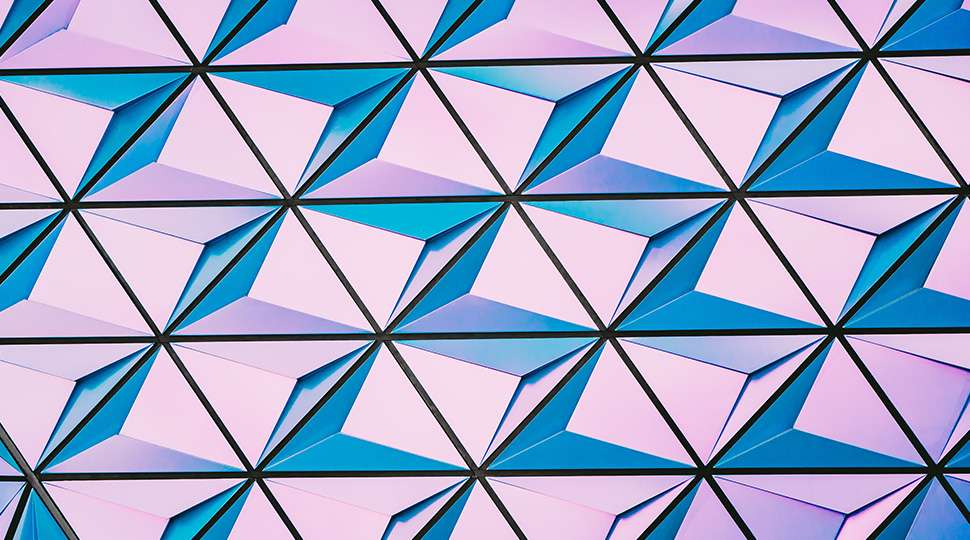
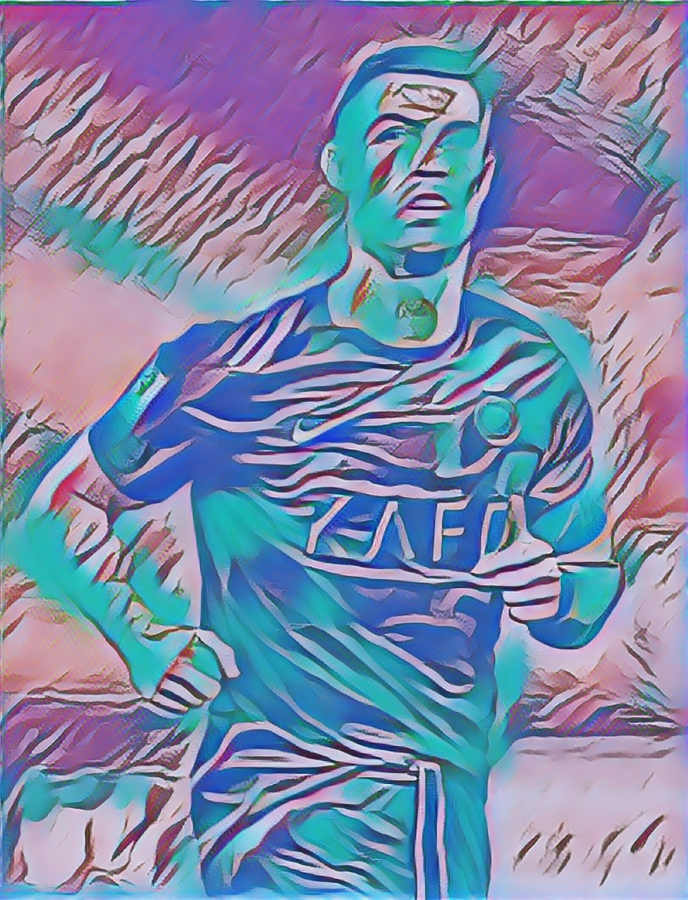

# 🧠🎨 Neural Style Transfer

This project performs **Neural Style Transfer** using TensorFlow Hub. It combines the **content of one image** (e.g., Cristiano Ronaldo) with the **style of another image** (e.g., abstract design) to generate a stylized output image.

> Built by [Arnab Kundu](https://github.com/arnabkundu03)

---

## 🖼️ Example Output

| Content Image            | Style Image              | Stylized Result          |
|--------------------------|--------------------------|---------------------------|
|   |   |  |

---

## 🚀 Getting Started

### 📥 Clone the repository

```bash
git clone https://github.com/arnabkundu03/neural-style-transfer.git
cd neural-style-transfer
```

### 📦 Install dependencies

Use pip to install required Python libraries:
```
pip install -r requirements.txt
```
✅ Ensure you have Python 3.10+ and pip installed.

### 🧪 Run the Notebook

Launch the Jupyter Notebook to perform style transfer:
```
jupyter notebook style.ipynb
```
Follow the instructions inside the notebook to run each cell step-by-step.

### 🛠 Libraries Used
All are listed in ```requirements.txt```.

### 📚 References

TensorFlow Hub - Arbitrary Image Stylization
Magenta Project
